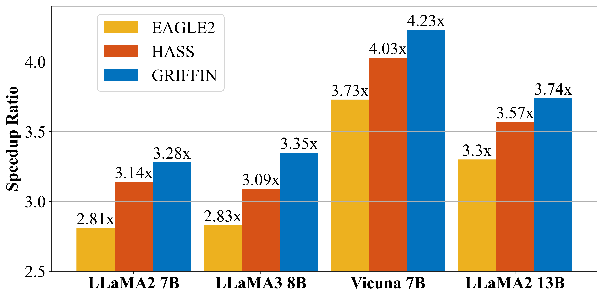

<div align="center"><h1>&nbsp;GRIFFIN</h1></div>

<p align="center">
| <a href="https://arxiv.org/abs/2502.11018"><b>Paper (GRIFFIN)</b></a> | 
</p>


<p align="center">
  <a href="">
    
  </a>
  <a href="https://opensource.org/licenses/Apache-2.0">
    
  </a>
  <a href="https://github.com/hsj576/GRIFFIN/issues">
    
  </a>
  <a href="https://github.com/hsj576/GRIFFIN/pulls">
    
  </a>
</p>


##

<p align="center">
  
</p>


## Overview 

**GRIFFIN** is a novel framework designed to address **token misalignment** in speculative decoding. This repository provides the implementation of GRIFFIN, including its token-alignable training strategy and token-alignable draft model.   

- GRIFFIN is:
  - **4.2x** faster than vanilla decoding.
  - **1.3x** faster than EAGLE-2.

## Update
**2025.2.24**: GRIFFIN v1.0 is released.

## Setup & Installation

To set up the environment, follow these steps:  


1. Clone the repository and navigate to the `GRIFFIN` directory:  
```bash  
   git clone https://github.com/hsj576/GRIFFIN.git
   cd GRIFFIN  
```

2. Install the required dependencies:

```bash   
pip install -r requirements.txt  
```

3. Update the paths in the code: Replace placeholders like `"your-model-paths"` and `"your-datasets-path"` with the actual paths to your models and datasets.

## GRIFFIN Weights

| Base Model  | EAGLE on Hugging Face  | Base Model  | EAGLE on Hugging Face  |
|------|------|------|------|
| Vicuna-7B-v1.5 | [husj576/GRIFFIN-Vicuna-7B-v1.5](https://huggingface.co/husj576/GRIFFIN-Vicuna-7B-v1.5) | LLaMA2-Chat 7B | [husj576/GRIFFIN-llama2-chat-7B](https://huggingface.co/husj576/GRIFFIN-llama2-chat-7B) |
| LLaMA3-Instruct 8B | [husj576/GRIFFIN-llama3-instruct-8B](https://huggingface.co/husj576/GRIFFIN-llama3-instruct-8B) | LLaMA2-Chat 13B | [husj576/GRIFFIN-llama2-chat-13B](https://huggingface.co/husj576/GRIFFIN-llama2-chat-13B) |

## Inference
The inference code we provide automatically allocates model weights (loading a model across multiple GPUs), allowing you to run models that exceed the memory of a single GPU.

We have provided a suggested web interface, which you can use by running the following command. After the model is fully loaded, a URL will be output in the terminal, which you can enter into your browser to access.
```bash
python -m application.webui --ea-model-path [path of GRIFFIN weight]\ 
		--base-model-path [path of the original model]\
		--model-type [vicuna\llama2\llama3]\
        --total-token [int]
```
The *total-token* is the number of draft tokens. For smaller models and advanced GPUs, this value can be set larger. Adjusting according to the specific device and model can achieve better results. 

## Training

To train GRIFFIN's token-alignable draft model, you first need to generate the training data and then proceed with the multi-step training process.

### Generate Train Data
You can run the following command to generate the training data.
```bash
python -m ge_data.allocation --outdir [path of data]
```
### Train the Draft Model

GRIFFIN's token-alignable training involves multiple training steps. For all steps beyond the first, the model is trained incrementally based on the checkpoints from the previous step. 

#### For train step 1

Run the following command for the first training step:

```bash
export PYTHONPATH="/your-GRIFFIN-path/GRIFFIN:$PYTHONPATH"

accelerate launch -m --mixed_precision=bf16 train.main_griffin_1 \
--tmpdir [path to training data] \
--cpdir [path to save checkpoints] \
--configpath [path to configuration file]  
```
#### For train step $j \ge 2$

For subsequent training steps $j \ge 2$, use the following command:

```bash
export PYTHONPATH="/your-GRIFFIN-path/GRIFFIN:$PYTHONPATH"

accelerate launch -m --mixed_precision=bf16 train.main_griffin_2 \
--tmpdir [path to training data] \
--cpdir [path to save checkpoints] \
--configpath [path to configuration file] \
--forward_num_total j \
--griffinpath [path to previous GRIFFIN model checkpoint]  
```

Example configuration files can be found in the `GRIFFIN/train` directory.


## Evaluation
To evaluate the performance and speed of GRIFFIN, use the provided scripts for different models. Run the following commands: 
```bash
./scripts/llama3_test_8b.sh
./scripts/llama2_test_7b.sh
./scripts/llama2_test_13b.sh
./scripts/vicuna_test_7b.sh
```

## Reference
For technical details and full experimental results, please check [the paper of GRIFFIN](https://arxiv.org/abs/2502.11018).
```
@misc{hu2025griffineffectivetokenalignment,
      title={GRIFFIN: Effective Token Alignment for Faster Speculative Decoding}, 
      author={Shijing Hu and Jingyang Li and Xingyu Xie and Zhihui Lu and Kim-Chuan Toh and Pan Zhou},
      year={2025},
      eprint={2502.11018},
      archivePrefix={arXiv},
      primaryClass={cs.CL},
      url={https://arxiv.org/abs/2502.11018}, 
}
```

## Acknowledgements

Our implementation is based on the opensource repository of [EAGLE](https://github.com/SafeAILab/EAGLE/tree/main). This project has been influenced by many excellent projects in the LLM community, such as [HASS](https://github.com/HArmonizedSS/HASS), [FSPAD](https://github.com/Luc4Gui/FSPAD), and others. 